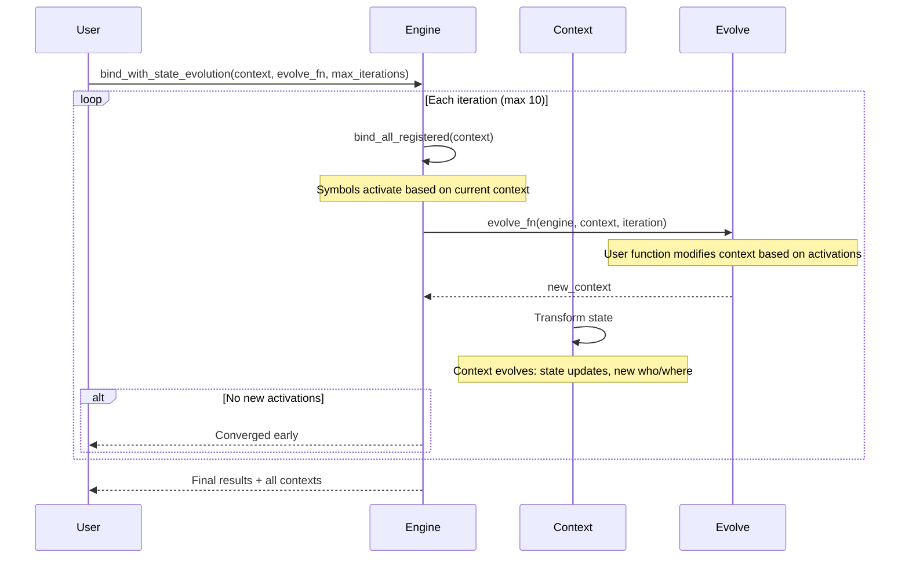
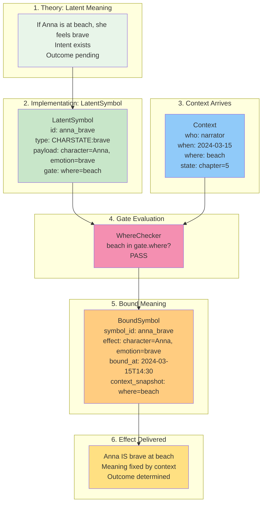
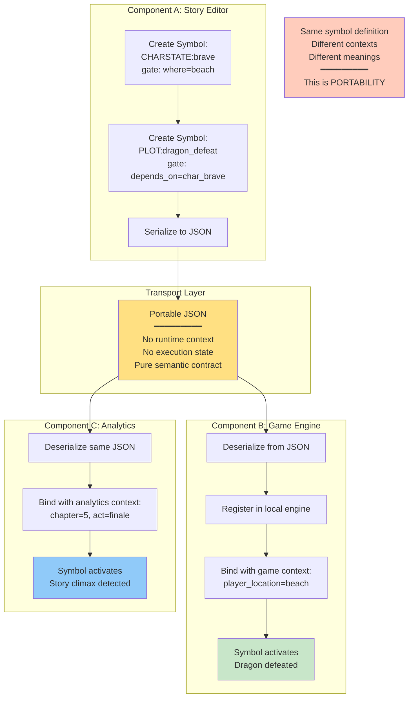
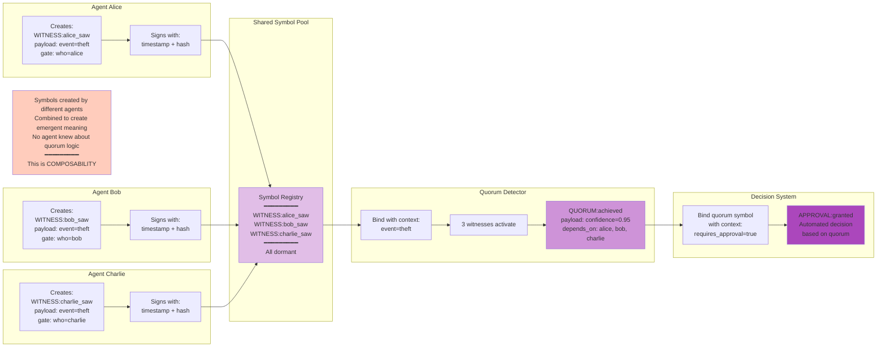

# Advanced Patterns - Composition and Portability

## State Evolution - Multi-Round Binding



**Pattern:** Context transformation between binding rounds enables reactive systems.

**Use cases:**
- Laboratory scenario: Door opens → researchers enter → experiments begin
- Approval chains: Manager approves → director review unlocked → publication enabled
- Game state: Player moves → enemies react → loot spawns

**Key insight:** State mutations in symbol payloads drive context evolution without manual orchestration.

---

## Complete Example - Theory to Practice



**Demonstrates:** End-to-end flow from theoretical concept (latent meaning) to concrete execution (bound symbol with fixed effect).

---

## Portable Contracts - Cross-Component Composition



**Pattern:** Symbols serialize to JSON and activate differently across components.

**Properties:**
- **Decoupled meaning:** Symbol definition independent of execution environment
- **Context-dependent activation:** Same symbol, different outcomes based on local context
- **Zero runtime coupling:** Components don't share state, only symbol contracts

**Use cases:**
- Editor creates symbols → Game engine executes them
- ML model produces symbols → Analytics consumes them
- Multi-agent system: Agents share symbol pool, bind from individual perspectives

---

## Multi-Agent Witness Quorum



**Pattern:** Independent agents contribute symbols that compose into higher-order meaning.

**Key properties:**
- **Emergent semantics:** Quorum meaning emerges from individual witness symbols
- **Decentralized creation:** No central coordinator required
- **Dependency-based composition:** QUORUM symbol depends on witness symbols
- **Automated decision:** Approval granted when quorum threshold met

**Use cases:**
- Multi-signature approval workflows
- Distributed consensus systems
- Byzantine fault tolerance (witness verification)
- Collaborative decision-making

---

## Dependency Cascade Example

**Scenario:** Document publication requires manager approval, then director approval, then legal review.

```python
from bindlang import LatentSymbol, GateCondition, Context, BindingEngine
from datetime import datetime

# Step 1: Manager approval
manager_approval = LatentSymbol(
    id="approve_manager",
    symbol_type="APPROVAL:manager",
    gate=GateCondition(who={"manager"}),
    payload={"approver": "manager", "document": "doc_123"}
)

# Step 2: Director approval (depends on manager)
director_approval = LatentSymbol(
    id="approve_director",
    symbol_type="APPROVAL:director",
    gate=GateCondition(who={"director"}),
    payload={"approver": "director", "document": "doc_123"},
    depends_on=["approve_manager"]
)

# Step 3: Legal review (depends on director)
legal_review = LatentSymbol(
    id="legal_review",
    symbol_type="REVIEW:legal",
    gate=GateCondition(who={"legal"}),
    payload={"reviewer": "legal", "document": "doc_123"},
    depends_on=["approve_director"]
)

# Step 4: Publish (depends on legal)
publish = LatentSymbol(
    id="publish_doc",
    symbol_type="EVENT:publish",
    gate=GateCondition(who={"system"}),
    payload={"document": "doc_123", "status": "published"},
    depends_on=["legal_review"]
)

engine = BindingEngine()
for symbol in [manager_approval, director_approval, legal_review, publish]:
    engine.register(symbol)

# Round 1: Manager approves
ctx_manager = Context(who="manager", when=datetime.now(), where="review", state={})
engine.bind(manager_approval, ctx_manager)

# Round 2: Director approves (now unblocked)
ctx_director = Context(who="director", when=datetime.now(), where="review", state={})
engine.bind(director_approval, ctx_director)

# Round 3: Legal reviews (now unblocked)
ctx_legal = Context(who="legal", when=datetime.now(), where="review", state={})
engine.bind(legal_review, ctx_legal)

# Round 4: System publishes (all dependencies met)
ctx_system = Context(who="system", when=datetime.now(), where="pipeline", state={})
result = engine.bind(publish, ctx_system)

if result:
    print("Document published after full approval chain")
```

**Result:** Each step activates only when dependencies are satisfied, creating a cascading approval workflow.

---

## Combining Patterns

**State Evolution + Dependencies + Multi-Actor:**

```python
from bindlang import ActorSequenceRunner, BindingEngine, LatentSymbol, GateCondition

engine = BindingEngine()

# Symbol 1: Lab opens (witness gate - activates for any actor)
lab_opens = LatentSymbol(
    id="lab_opens",
    symbol_type="EVENT:open",
    gate=GateCondition(who=None, where={"lab"}),
    payload={"state_mutation": {"lab_open": True}}
)

# Symbol 2: Researcher arrives (depends on lab being open)
researcher_arrives = LatentSymbol(
    id="researcher_arrives",
    symbol_type="ACTION:arrive",
    gate=GateCondition(who={"researcher_a"}, state={"lab_open": True}),
    payload={"state_mutation": {"researcher_a_present": True}}
)

# Symbol 3: Experiment starts (depends on researcher presence)
experiment_starts = LatentSymbol(
    id="experiment_starts",
    symbol_type="EVENT:experiment",
    gate=GateCondition(state={"researcher_a_present": True}),
    payload={"experiment": "alpha", "status": "running"}
)

engine.register(lab_opens)
engine.register(researcher_arrives)
engine.register(experiment_starts)

# Run multi-actor sequence
runner = ActorSequenceRunner(engine)
actor_contexts = [
    {"who": None, "where": "lab"},  # System opens lab
    {"who": "researcher_a", "where": "lab"},  # Researcher arrives
    {"who": "supervisor", "where": "lab"}  # Supervisor observes
]

bound, final_state = runner.run_actor_sequence(actor_contexts, initial_state={})

print(f"Final state: {final_state}")
# Output: {'lab_open': True, 'researcher_a_present': True}
```

**Combines:**
- Witness gates (`who=None`)
- State mutations (lab_open, researcher_a_present)
- Dependencies (researcher → experiment)
- Multi-actor orchestration (system, researcher, supervisor)

---

## See Also

- [Core Architecture](core-architecture.md) - Fundamental system design
- [Template System](template-system.md) - Reusable symbol blueprints
- [Orchestration Reference](../reference/orchestration.md) - ActorSequenceRunner API
- [Common Patterns](../reference/patterns.md) - Pattern catalog
- [State Mutations Guide](../guides/state-mutations.md) - State evolution mechanics
