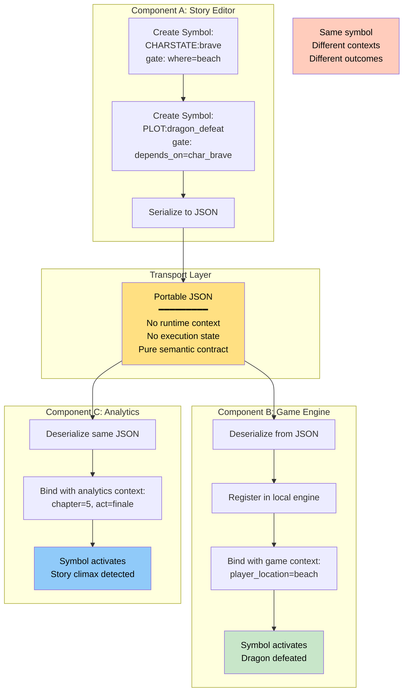
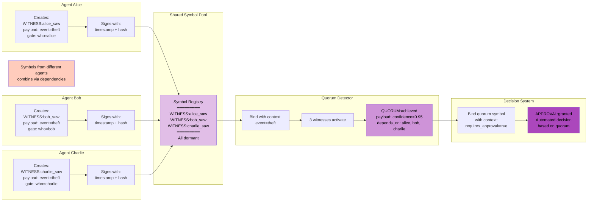

# Advanced Patterns - Composition and Portability

## State Evolution - Multi-Round Binding


**Pattern:** Context transformation between binding rounds.

**Use cases:**
- Laboratory scenario: Door opens, researchers enter, experiments begin
- Approval chains: Manager approves, director review unlocked, publication enabled
- Game state: Player moves, enemies react, loot spawns

---

## Portable Contracts - Cross-Component Composition



**Pattern:** Symbols serialize to JSON and activate differently across components.

**Use cases:**
- Editor creates symbols, game engine executes them
- ML model produces symbols, analytics consumes them
- Multi-agent: Agents share symbol pool, bind from individual perspectives

---

## Multi-Agent Witness Quorum



**Pattern:** Independent agents contribute symbols that compose via dependencies.

**Use cases:**
- Multi-signature approval workflows
- Distributed consensus
- Collaborative decision-making

---

## Dependency Cascade Example

**Scenario:** Document publication requires manager approval, then director approval, then legal review.

```python
from bindlang import LatentSymbol, GateCondition, Context, BindingEngine
from datetime import datetime

# Step 1: Manager approval
manager_approval = LatentSymbol(
    id="approve_manager",
    symbol_type="APPROVAL:manager",
    gate=GateCondition(who={"manager"}),
    payload={"approver": "manager", "document": "doc_123"}
)

# Step 2: Director approval (depends on manager)
director_approval = LatentSymbol(
    id="approve_director",
    symbol_type="APPROVAL:director",
    gate=GateCondition(who={"director"}),
    payload={"approver": "director", "document": "doc_123"},
    depends_on=["approve_manager"]
)

# Step 3: Legal review (depends on director)
legal_review = LatentSymbol(
    id="legal_review",
    symbol_type="REVIEW:legal",
    gate=GateCondition(who={"legal"}),
    payload={"reviewer": "legal", "document": "doc_123"},
    depends_on=["approve_director"]
)

# Step 4: Publish (depends on legal)
publish = LatentSymbol(
    id="publish_doc",
    symbol_type="EVENT:publish",
    gate=GateCondition(who={"system"}),
    payload={"document": "doc_123", "status": "published"},
    depends_on=["legal_review"]
)

engine = BindingEngine()
for symbol in [manager_approval, director_approval, legal_review, publish]:
    engine.register(symbol)

# Round 1: Manager approves
ctx_manager = Context(who="manager", when=datetime.now(), where="review", state={})
engine.bind(manager_approval, ctx_manager)

# Round 2: Director approves (now unblocked)
ctx_director = Context(who="director", when=datetime.now(), where="review", state={})
engine.bind(director_approval, ctx_director)

# Round 3: Legal reviews (now unblocked)
ctx_legal = Context(who="legal", when=datetime.now(), where="review", state={})
engine.bind(legal_review, ctx_legal)

# Round 4: System publishes (all dependencies met)
ctx_system = Context(who="system", when=datetime.now(), where="pipeline", state={})
result = engine.bind(publish, ctx_system)

if result:
    print("Document published after full approval chain")
```

Each step activates only when dependencies are satisfied.

---

## Combining Patterns

**State Evolution + Dependencies + Multi-Actor:**

```python
from bindlang import ActorSequenceRunner, BindingEngine, LatentSymbol, GateCondition

engine = BindingEngine()

# Symbol 1: Lab opens (witness gate - activates for any actor)
lab_opens = LatentSymbol(
    id="lab_opens",
    symbol_type="EVENT:open",
    gate=GateCondition(who=None, where={"lab"}),
    payload={"state_mutation": {"lab_open": True}}
)

# Symbol 2: Researcher arrives (depends on lab being open)
researcher_arrives = LatentSymbol(
    id="researcher_arrives",
    symbol_type="ACTION:arrive",
    gate=GateCondition(who={"researcher_a"}, state={"lab_open": True}),
    payload={"state_mutation": {"researcher_a_present": True}}
)

# Symbol 3: Experiment starts (depends on researcher presence)
experiment_starts = LatentSymbol(
    id="experiment_starts",
    symbol_type="EVENT:experiment",
    gate=GateCondition(state={"researcher_a_present": True}),
    payload={"experiment": "alpha", "status": "running"}
)

engine.register(lab_opens)
engine.register(researcher_arrives)
engine.register(experiment_starts)

# Run multi-actor sequence
runner = ActorSequenceRunner(engine)
actor_contexts = [
    {"who": None, "where": "lab"},  # System opens lab
    {"who": "researcher_a", "where": "lab"},  # Researcher arrives
    {"who": "supervisor", "where": "lab"}  # Supervisor observes
]

bound, final_state = runner.run_actor_sequence(actor_contexts, initial_state={})

print(f"Final state: {final_state}")
# Output: {'lab_open': True, 'researcher_a_present': True}
```

**Combines:**
- Witness gates (`who=None`)
- State mutations (lab_open, researcher_a_present)
- Dependencies (researcher → experiment)
- Multi-actor orchestration (system, researcher, supervisor)

---

## See Also

- [Core Architecture](core-architecture.md)
- [Template System](template-system.md)
- [Orchestration Reference](../reference/orchestration.md)
- [Common Patterns](../reference/patterns.md)
- [State Mutations Guide](../guides/state-mutations.md)
