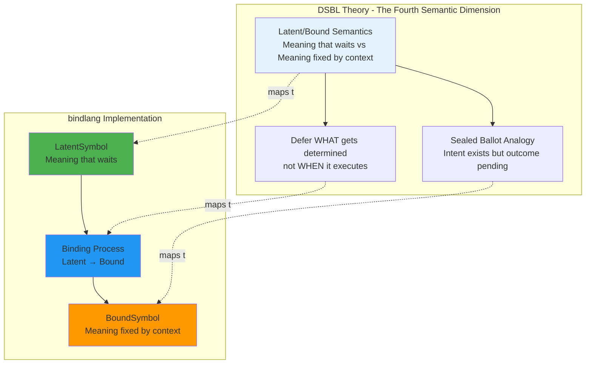
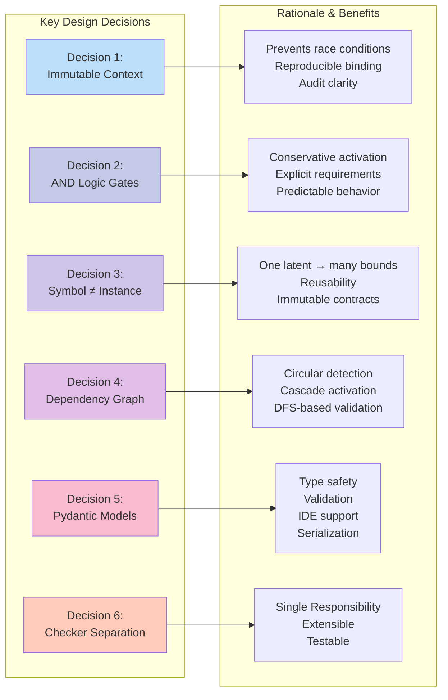
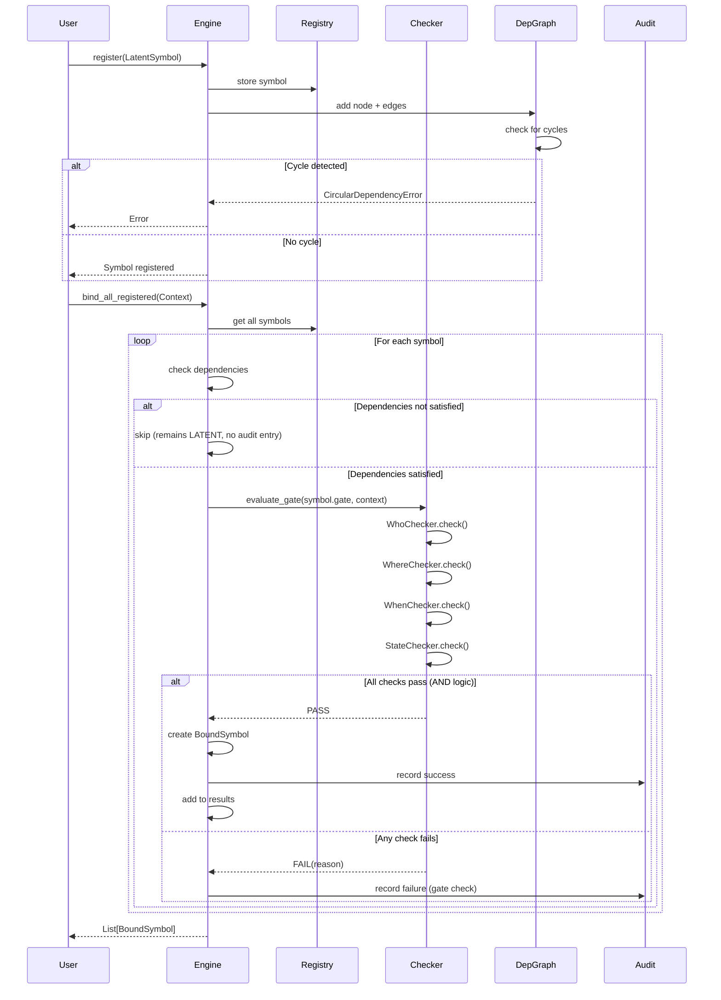
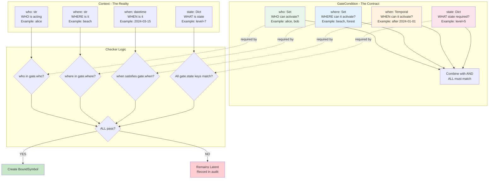
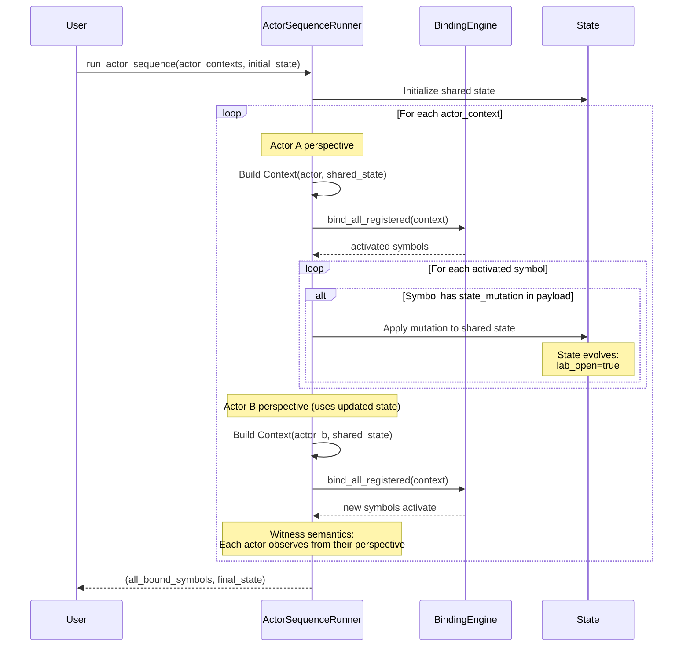

# bindlang Core Architecture

## Theoretical Foundation → Implementation



## Core Architecture - System Overview


## Design Decision Map



## Binding Process - Detailed Flow



## The Gate System - Context Matching



## Dependency System - Cascade Activation


## Multi-Actor Orchestration - ActorSequenceRunner



**Key Properties:**
- **Sequential perspectives**: Each actor binds in order
- **Shared state**: Mutations from one actor affect next actor's context
- **Witness semantics**: `who=None` gates activate for any actor
- **State accumulation**: Final state reflects all mutations

## Audit Trail - Tracking Binding Attempts

```mermaid
graph TB
    subgraph "BindingAttempt Model"
        BA[BindingAttempt<br/>━━━━━━━━━<br/>symbol_id: str<br/>success: bool<br/>attempt_timestamp: datetime<br/>context_snapshot: Dict<br/>failure_reasons: List[FailureReason]]

        FR[FailureReason<br/>━━━━━━━━━<br/>category: str<br/>message: str<br/>gate_dimension: str]

        BA --> FR
    end

    subgraph "AuditSink System"
        Sink[AuditSink<br/>Abstract base class]

        JSONSink[JSONLFileSink<br/>Streaming JSONL output]
        ConsoleSink[ConsoleSink<br/>stdout logging]
        CustomSink[Custom implementations<br/>SQLite, in-memory, etc]

        JSONSink -.implements.-> Sink
        ConsoleSink -.implements.-> Sink
        CustomSink -.implements.-> Sink
    end

    subgraph "Integration with Engine"
        Engine[BindingEngine<br/>audit_sink: AuditSink]

        Success[On binding success:<br/>Record attempt with success=True]
        Failure[On gate failure:<br/>Record attempt with reasons]

        Engine --> Success
        Engine --> Failure

        Success --> Sink
        Failure --> Sink
    end

    subgraph "Failure Categories"
        Cat1[DEPENDENCY_NOT_MET<br/>Required symbols not bound]
        Cat2[GATE_WHO_FAILED<br/>who not in gate.who]
        Cat3[GATE_WHERE_FAILED<br/>where not in gate.where]
        Cat4[GATE_WHEN_FAILED<br/>Temporal condition not met]
        Cat5[GATE_STATE_FAILED<br/>State key mismatch]
    end

    FR -.category.-> Cat1
    FR -.category.-> Cat2
    FR -.category.-> Cat3
    FR -.category.-> Cat4
    FR -.category.-> Cat5

    style BA fill:#E1BEE7
    style FR fill:#F48FB1
    style Sink fill:#90CAF9
    style Engine fill:#CE93D8
```

**Usage:**
- Debug failed activations: Check `failure_reasons` for specific gate dimension
- Performance analysis: Count attempts per symbol over time
- Compliance audit: Track who attempted what, when, and result
- Custom sinks: Extend `AuditSink` for database, metrics, or logging integration

## Summary: Theory → Design → Implementation

| Theoretical Concept | Design Decision | Implementation |
|---------------------|-----------------|----------------|
| **Latent semantics** | Symbols carry potential meaning | `LatentSymbol` with payload |
| **Context-dependent activation** | Gates define activation conditions | `GateCondition` + Checker system |
| **Bound semantics** | Context fixes meaning | `BoundSymbol` with effect |
| **Immutability** | Contracts don't change | Pydantic frozen models |
| **Explicit causality** | Track what activated why | Audit trail + context snapshot |
| **Dependency tracking** | Some symbols need others first | DFS-based dependency graph |
| **Multi-actor coordination** | Sequential perspectives with shared state | ActorSequenceRunner |
| **Separation of concerns** | Checkers are independent | One checker per dimension |
| **Type safety** | Validate contracts | Pydantic + template validation |

**Core insight:** The "Latent/Bound" semantic dimension is implemented through:
1. **LatentSymbol** = Semantic potential (what COULD happen)
2. **GateCondition** = Activation contract (WHEN it happens)
3. **Context** = Runtime reality (what IS)
4. **Checker system** = Evaluation logic (does reality match contract?)
5. **BoundSymbol** = Fixed meaning (what DID happen)

This maps the theoretical "sealed ballot" analogy directly into executable code.

## See Also

- [Template System](template-system.md) - Reusable symbol blueprints
- [Advanced Patterns](advanced-patterns.md) - Composition and portability examples
- [Reference Documentation](../reference/index.md) - API reference
