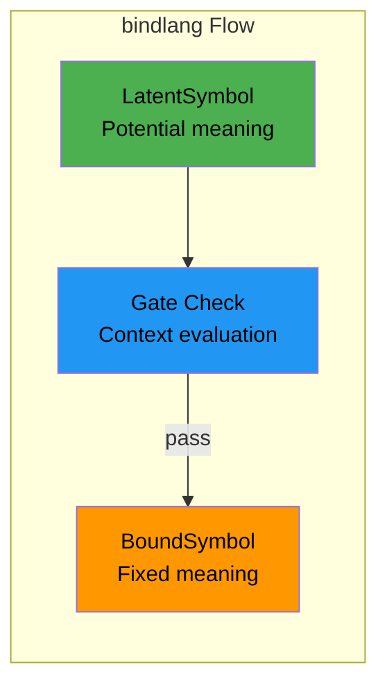
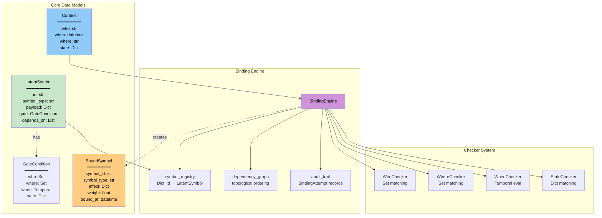
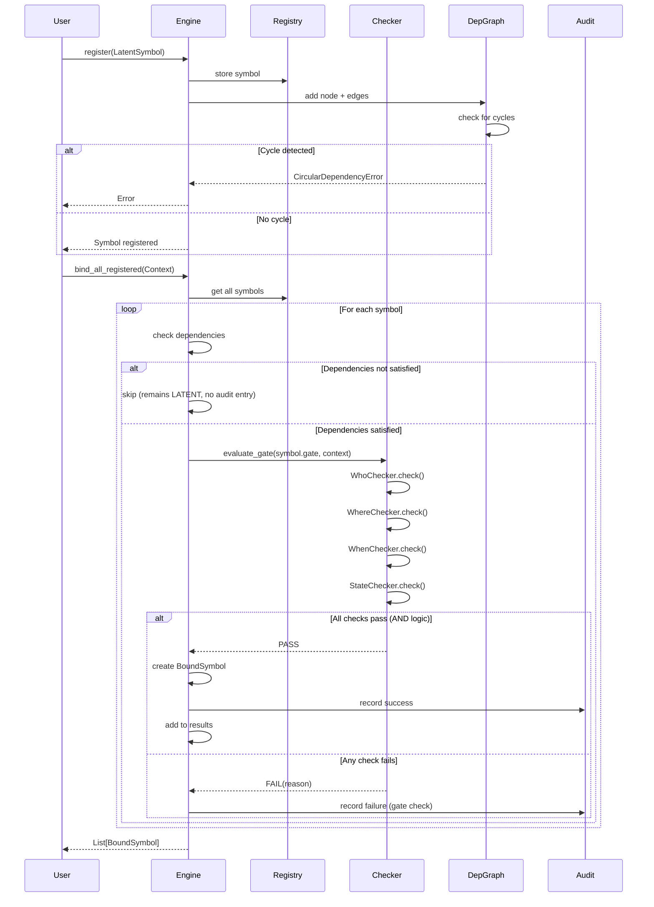
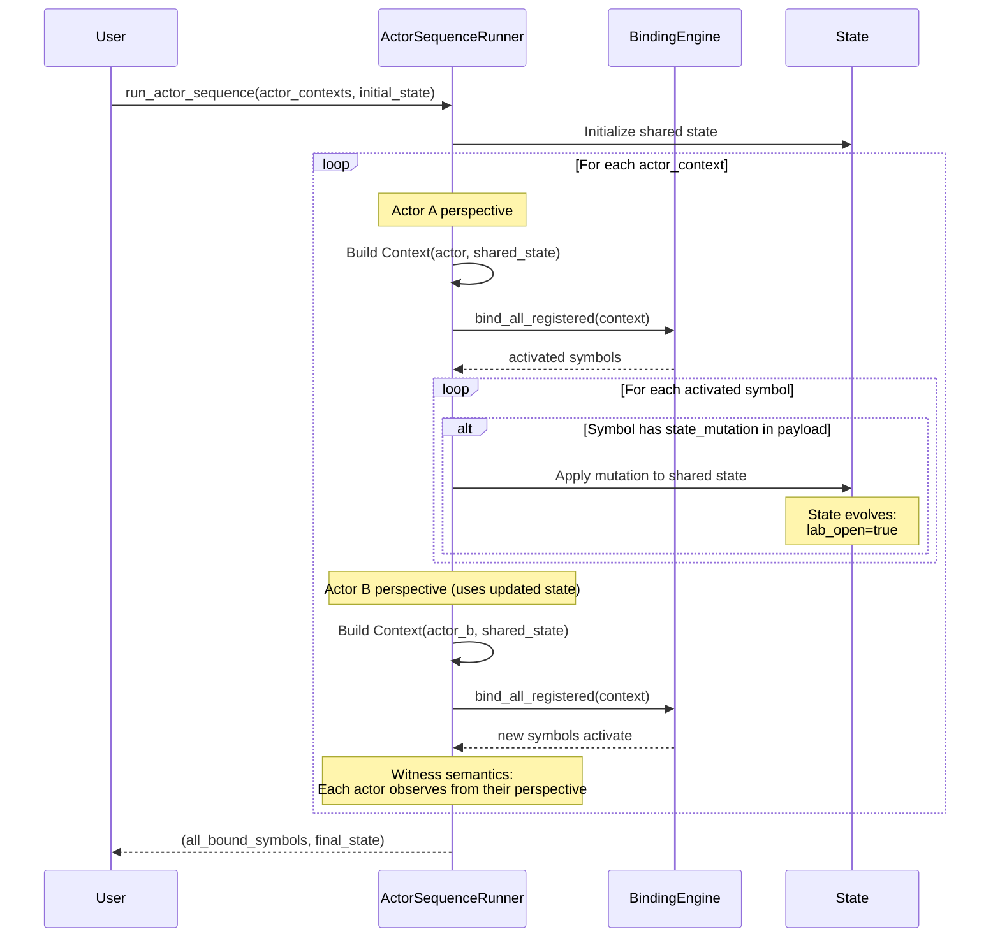
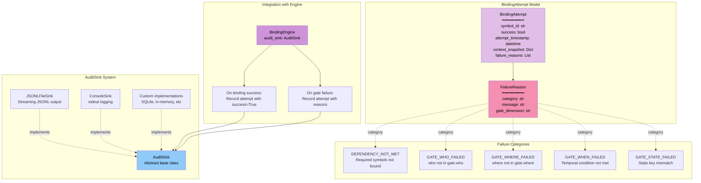

# bindlang Core Architecture

## Core Concept

bindlang separates **what could happen** from **what does happen**.

Instead of imperative orchestration ("do X, then Y, wait for Z"), bindlang uses declarative contracts. Symbols define their activation conditions and remain latent until context satisfies them:

Symbols carry intent that remains dormant until context activates them. See [Foundation](../theory/FOUNDATION.md) for theoretical background.

## Core Architecture - System Overview

## Binding Process - Detailed Flow

## Dependency System - Cascade Activation

```mermaid
graph TB
    subgraph "Dependency Chain Example"
        A[Symbol A<br/>No dependencies<br/>Gate: who=alice]
        B[Symbol B<br/>depends_on: A<br/>Gate: where=beach]
        C[Symbol C<br/>depends_on: B<br/>Gate: state.ready=true]
        D[Symbol D<br/>depends_on: B and C<br/>Gate: None]

        A -->|must bind first| B
        B -->|must bind first| C
        B -->|must bind first| D
        C -->|must bind first| D
    end

    subgraph "Dependency Graph"
        direction LR
        NodeA((A))
        NodeB((B))
        NodeC((C))
        NodeD((D))

        NodeA -.edge.-> NodeB
        NodeB -.edge.-> NodeC
        NodeB -.edge.-> NodeD
        NodeC -.edge.-> NodeD
    end

    subgraph "Binding Rounds"
        R1[Round 1:<br/>Context: who=alice<br/>Result: A binds]
        R2[Round 2:<br/>Context: where=beach<br/>Result: B binds<br/>A already bound]
        R3[Round 3:<br/>Context: state.ready=true<br/>Result: C binds<br/>B already bound]
        R4[Round 4:<br/>Context: any<br/>Result: D binds<br/>B,C already bound]

        R1 --> R2
        R2 --> R3
        R3 --> R4
    end

    subgraph "Circular Detection"
        X[Symbol X<br/>depends_on: Y]
        Y[Symbol Y<br/>depends_on: Z]
        Z[Symbol Z<br/>depends_on: X]

        X --> Y
        Y --> Z
        Z --> X

        Error[CircularDependencyError<br/>Cycle: X → Y → Z → X]

        Z -.detected.-> Error
    end

    style A fill:#C8E6C9,color:#000
    style B fill:#A5D6A7,color:#000
    style C fill:#81C784,color:#000
    style D fill:#66BB6A,color:#000
    style Error fill:#EF5350,color:#000
```

## Multi-Actor Orchestration - ActorSequenceRunner

Each actor binds in order. State mutations affect subsequent actors. `who=None` gates activate for any actor.

## Audit Trail - Tracking Binding Attempts

Check `failure_reasons` for debugging. Extend `AuditSink` for custom storage.

## See Also

- [Template System](template-system.md)
- [Advanced Patterns](advanced-patterns.md)
- [Reference Documentation](../reference/index.md)
