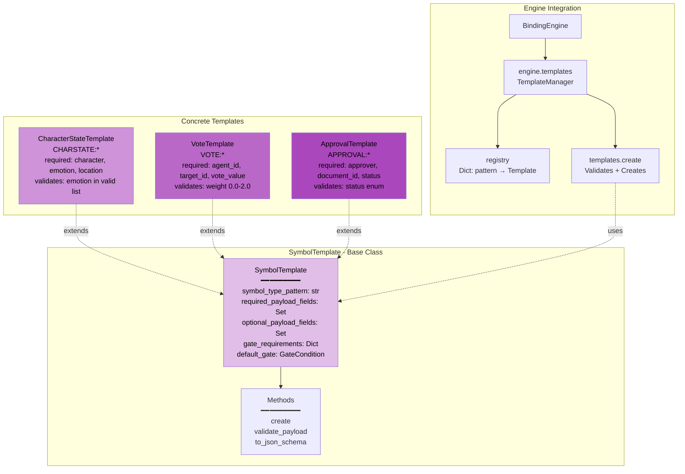

# Template System - Reusable Contracts

## SymbolTemplate Architecture



## Template Lifecycle

**1. Define Template**
```python
from bindlang.core.templates import SymbolTemplate
from bindlang import GateCondition

vote_template = SymbolTemplate(
    symbol_type_pattern="VOTE:*",
    required_payload_fields={"agent_id", "target_id", "vote_value"},
    optional_payload_fields={"weight", "timestamp"},
    default_gate=GateCondition(who={"voter"})
)
```

**2. Register Template**
```python
from bindlang import BindingEngine

engine = BindingEngine()
engine.templates.register(vote_template)
```

**3. Create Symbols from Template**
```python
# Template validates payload automatically
vote = engine.templates.create(
    template_pattern="VOTE:*",
    id="vote_promote_bob",
    symbol_type="VOTE:promote",
    payload={"agent_id": "alice", "target_id": "bob", "vote_value": 1.0},
    gate=GateCondition(who={"admin"})  # Override default
)
```

**4. Validation Enforcement**
```python
# Raises ValueError: missing required field 'target_id'
vote = engine.templates.create(
    template_pattern="VOTE:*",
    id="vote_invalid",
    symbol_type="VOTE:promote",
    payload={"agent_id": "alice", "vote_value": 1.0}
)
```

## JSON Schema Generation

Templates can generate JSON schemas for LLM integration:

```python
template = VoteTemplate()
schema = template.to_json_schema()

# Returns:
{
    "type": "object",
    "properties": {
        "agent_id": {"type": "string"},
        "target_id": {"type": "string"},
        "vote_value": {"type": "number"},
        "weight": {"type": "number"},  # optional
        "timestamp": {"type": "string"}  # optional
    },
    "required": ["agent_id", "target_id", "vote_value"]
}
```

## See Also

- [Core Architecture](core-architecture.md)
- [Templates Reference](../reference/templates.md)
- [Pattern Library](../reference/patterns.md)
